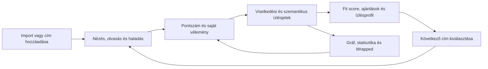
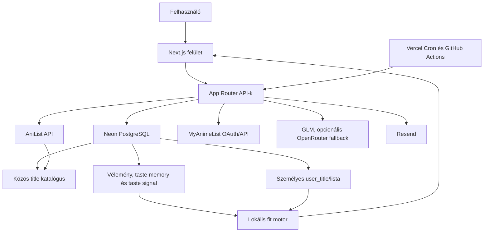

# Anime Graph — termékdokumentáció és brainstorming-alap

> Állapotfelvétel: 2026. augusztus 6.  
> Vizsgált kódállapot: `869b683` és az aktuális munkafa.  
> A dokumentum célja: egy helyen, részletesen bemutatni, hogy az Anime Graph jelenleg mit tud, hogyan néz ki, hogyan működik a háttérben, és milyen irányokban érdemes továbbgondolni.

---

## 0. Hogyan olvasd ezt a dokumentumot?

Ez nem pusztán funkciólista. Négy külön nézőpontot kapcsol össze:

1. **Termék:** milyen problémát old meg, kinek és milyen élménnyel.
2. **Felület:** hogyan néz ki, hogyan lehet bejárni, milyen a vizuális nyelve.
3. **Rendszer:** milyen adatból, algoritmusból és külső szolgáltatásból áll össze.
4. **Brainstorm:** mi lehet belőle később, mely ötletek illenek a termék magjához, és milyen kérdéseket kell még eldönteni.

### Állapotjelölések

| Jelölés | Jelentés |
|---|---|
| **Kész** | A jelenlegi kódban megtalálható, használható termékfunkció. Ez önmagában nem bizonyítja, hogy egy konkrét production-környezetben minden szükséges titok és külső fiók be van állítva. |
| **Telepítésfüggő** | A kód megvan, de működéséhez külső kulcs, OAuth-app, cron, e-mail-domain vagy production-konfiguráció kell. |
| **Korlátozott** | Használható első verzió, de tudatosan szűkebb a teljes elképzelhető megoldásnál. |
| **Ötlet** | Brainstorming-javaslat, nem jelenlegi funkció. |

### Fontos pontossági megjegyzések

- A dokumentum a repó alapján állítja, hogy mi van megvalósítva; nem állítja, hogy az összes külső integrációt éles hitelesítő adatokkal végigtesztelték.
- A katalógus mérete adatbázis- és szinkronfüggő. A jelenlegi felületi kommunikáció körülbelül **22 000+ animét**, **136 000+ mangát**, illetve összesen **150 000+ címet** említ.
- A régebbi magyar útvonalak még kompatibilitási okból léteznek, de a felhasználóknak szánt kanonikus URL-ek angolok, például `/browse`, `/graph`, `/settings`.
- A „jelenlegi termék” és az „ötlet” részek szándékosan külön vannak választva, hogy egy brainstorm során ne keveredjen össze a valós állapot a vízióval.

---

# I. Gyors termékkép

## 1. Az Anime Graph egy mondatban

Az Anime Graph egy személyes anime- és manga-intelligenciafelület: nemcsak nyilvántartja, mit láttál vagy olvastál, hanem a listád, pontszámaid és saját szöveges véleményeid alapján megpróbálja megérteni az ízlésedet, megmutatni annak szerkezetét, és jobb következő választást adni.

## 2. Rövid pitch

A hagyományos anime-listák általában azt válaszolják meg, hogy:

- mit láttál;
- mit nézel;
- mit tervezel;
- hány pontot adtál.

Az Anime Graph ennél egy réteggel tovább megy:

- **vizuális térképet** készít a gyűjteményedből;
- **ízlésprofilt** épít a viselkedésedből és a véleményeidből;
- minden katalóguscímnél megmutathatja, hogy **mennyire neked való**;
- helyzethez illő választ adhat arra, hogy **„mit nézzek ma este?”**;
- szezonális, közösségi és páros döntésekben is használja ugyanezt az ízlésmodellt;
- a saját adataidat és nyers véleményeidet alapvetően személyes kontextusként kezeli, nem automatikus nyilvános tartalomként.

## 3. A termék alapígérete

> **Ne csak vezesd a listádat. Értsd is, mit szeretsz — és használd ezt a következő döntésedhez.**

Ez az ígéret három egymásra épülő termékpillérből áll:

### 3.1. Gyűjtemény

Egy központi hely anime- és mangacímekhez, státuszhoz, haladáshoz, pontszámhoz, újranézéshez, véleményhez és importhoz.

### 3.2. Ízlésintelligencia

A rendszer műfajokból, tagekből, formátumból, korszakból, hosszúságból, stúdióból, forrásból, pontszámokból, dobásokból és szöveges véleményekből személyes ízlésjeleket épít.

### 3.3. Döntéstámogatás

Az ízlésmodell nem csak egy statisztikaoldalon látszik: bekerül a címoldalba, az ajánlásba, a szezonális kínálatba, a Vibe-keresőbe, a páros összehasonlításba és a csoportos választásba.

## 4. A termék hurka



A jó termékélmény itt nem egyetlen látványos képernyőtől függ. A valódi érték akkor nő, amikor a felhasználó többször végigmegy ezen a hurkon. Minden új pontszám, vélemény és befejezett cím pontosabb személyes kontextust ad.

## 5. Mi különbözteti meg egy sima listakezelőtől?

| Hagyományos lista | Anime Graph |
|---|---|
| Táblázat arról, mit láttál | Táblázat és térkép arról, hogyan áll össze az ízlésed |
| Általános népszerűségi rangsor | Személyes illeszkedési pontszám is |
| Szöveges review mint publikáció | Privát vélemény mint személyes tanítójel |
| „Mindenkinek ugyanaz” ajánló | Saját listára, elutasításokra és véleményekre épülő rangsor |
| Külön statisztikaoldal | Az ízlésadat több termékfelületen visszaforgatva |
| Kétdimenziós lista vagy rács | Háromdimenziós, kapcsolati és időbeli gráf |
| Egyéni választás | Páros és csoportos kompatibilitási döntés is |

## 6. Lehetséges kategóriameghatározás

Az Anime Graph hosszú távon nem feltétlenül „újabb anime tracker”. Erősebb kategóriameghatározások lehetnek:

- **personal anime intelligence**;
- **taste operating system for anime and manga**;
- **visual anime memory**;
- **decision layer a meglévő MAL/AniList-listád fölött**;
- **személyes médiatérkép, amelyből ajánlás születik**.

Ezek közül a jelenlegi termékhez a „személyes anime-intelligencia” áll a legközelebb, mert egyszerre fogja össze a listát, a gráfot, az ízlésmodellt és a döntéstámogatást.

---

# II. Célcsoportok és felhasználói feladatok

## 7. Elsődleges felhasználói típusok

### 7.1. A listaveterán

Jellemzői:

- több száz címes MAL- vagy AniList-listája van;
- már nem a nyilvántartás létrehozása a gondja, hanem az, hogy mit kezdjen vele;
- szeretné látni a mintákat, korszakokat, műfaji eltolódásokat;
- értékeli az importot, a statisztikát és a gráfot.

Fő feladata: **„Mutasd meg, mit mond rólam az elmúlt évek listája.”**

### 7.2. A döntésben elakadó néző

Jellemzői:

- sok tervezett címe van;
- gyakran több időt tölt választással, mint nézéssel;
- hangulat, hossz vagy tempó alapján szeretne dönteni;
- fontos neki, hogy az ajánlás indokolható legyen.

Fő feladata: **„Adj ma estére egy jó, vállalható választást.”**

### 7.3. A szezonkövető

Jellemzői:

- több futó sorozatot követ;
- tudni akarja, mikor érkezik a következő epizód;
- gyors `+1` haladást és heti áttekintést szeretne;
- a következő szezonból nem akar mindent végignézni, csak a hozzá illő címeket.

Fő feladata: **„Tartsd össze a most futó szezonomat.”**

### 7.4. Az ízléskutató

Jellemzői:

- szeret beszélni arról, hogy egy címben mi működött vagy nem működött;
- nem elég neki a 7/10;
- érdeklik a visszatérő motívumok, stúdiók, tempók és korszakok;
- szívesen látna ízlés-portrét vagy időbeli változást.

Fő feladata: **„Segíts megfogalmazni, milyen történetek és megoldások találnak el.”**

### 7.5. A közös estét szervező baráti kör

Jellemzői:

- két vagy több ember eltérő listájából keres közös címet;
- nem pusztán átfedést, hanem kompromisszumot akar;
- fontos, hogy senkinek ne legyen nyilvánvalóan rossz választás.

Fő feladata: **„Találj valamit, amit mindannyian jó eséllyel élvezünk.”**

## 8. Fő Jobs-to-be-Done mondatok

- Amikor új platformra váltok, importálni akarom a listámat, hogy ne kelljen elölről kezdenem.
- Amikor egy címoldalt nézek, tudni akarom, mennyire illik hozzám, ne csak azt, hogy általában népszerű-e.
- Amikor befejezek valamit, egy rövid saját megjegyzéssel szeretném javítani a jövőbeli ajánlásaimat.
- Amikor elveszek a watchlistemben, hangulat és időkeret alapján szeretnék választani.
- Amikor szezon közben követek több címet, egy mozdulattal akarom rögzíteni a következő részt.
- Amikor visszanézek egy évre, szeretném történetként és megosztható vizuálként látni.
- Amikor baráttal választunk, olyan közös ajánlást akarunk, amely egyikünk ízlését sem áldozza fel teljesen.
- Amikor megosztom a profilomat, kontrollálni akarom, hogy mi legyen nyilvános, és a privát véleményeim maradjanak privátak.

---

# III. Információs architektúra és útvonalak

## 9. A termék fő felületei

### 9.1. Nyilvános felületek

| Kanonikus útvonal | Cél | Fő tartalom |
|---|---|---|
| `/` | Belépési pont | Vendég landing vagy bejelentkezve személyes Today/News kezdőlap |
| `/browse` | Katalógus | Keresés, anime/manga váltás, szezonok, népszerű címek |
| `/anime/[slug]` | Anime-címoldal | Metaadat, leírás, szereplők, stáb, zene, kapcsolatok, streamlinkek, személyes overlay |
| `/manga/[slug]` | Manga-címoldal | A címoldal manga-változata |
| `/anime/preview/[anilistId]` | Külső találat előnézete | Még nem lokális katalóguscím gyors felvétele |
| `/leaderboard` | Nyilvános toplista | Belső pontszám, AniList-pontszám és népszerűség szerinti rangsor |
| `/community` | Közösségi aktivitás | Nyilvános profilok pontozási aktivitása, nyers véleményszöveg nélkül |
| `/u/[username]` | Felhasználói profil | Bio, avatar, kitűzött címek és karakterek; privát profilnál 404 |
| `/p/[token]` | Tokenes megosztott gyűjtemény | Jelszó nélküli, csak olvasható teljes lista és összegzés |
| `/login` | Azonosítás | Bejelentkezés és regisztráció |
| `/adatvedelem`, `/aszf`, `/impresszum` | Jogi oldalak | Adatkezelés, feltételek, üzemeltetői adatok |

### 9.2. Bejelentkezéshez kötött felületek

| Kanonikus útvonal | Cél | Fő tartalom |
|---|---|---|
| `/graph` | Gyűjtemény vizuális térképe | 3D gráf, hierarchia, idővonal, time travel, karakter- és stábréteg |
| `/list` | Napi listakezelés | Anime/manga lista, státusz, haladás, pontszám, gyors `+1`, AI-keresés |
| `/reviews` | Vélemény-inbox | Olyan címek, amelyekhez még nincs feldolgozott saját vélemény |
| `/vibe` | Hangulatalapú választó | Chipek, szabad szöveg, saját listás kontextus, új és meglévő találatok |
| `/statistics` | Személyes analitika | Státuszok, műfajok, stúdiók, évek, aktivitás, ízlés-portré és -kártya |
| `/versus` | Páros/csoportos döntés | Átfedés, kompatibilitás, Duo-ajánló, Club-ajánló |
| `/wrapped` | Éves történet | Éves összefoglaló képernyők, story mód, letölthető kártya |
| `/notifications` | Közelgő epizódok | A következő 14 nap releváns premierjei |
| `/settings` | Beállítások és adatkezelés | Profil, nyelv, import, sync, push, megosztás, export, törlés |
| `/onboarding` | Első használat | Import és induló lista létrehozása |

### 9.3. Régi és belső útvonalak

A kódbázis történetileg magyar útvonalneveket használ, például `/graf`, `/lista`, `/bongeszo`, `/beallitasok`, `/velemenyek`, `/toplista`, `/stats` és `/vs`. A middleware ezeket angol kanonikus útvonalakkal köti össze. A termékkommunikációban és külső linkekben érdemes következetesen az angol URL-eket használni.

## 10. Navigációs modell

### Asztali, bejelentkezett állapot

Az elsődleges navigáció a napi magfeladatokat emeli ki:

- Hírek/kezdőlap;
- Gráf;
- Lista;
- Böngésző;
- Vélemények.

A „Több” menüben vannak a ritkább vagy elemző felületek:

- Toplista;
- Közösség;
- Újdonságok;
- Vibe;
- Stats;
- VS;
- Wrapped.

Ezek mellett jelenik meg a globális keresés, a nyelvváltó és a beállítások.

### Mobil, bejelentkezett állapot

A felső, lebegő navigáció helyett safe-area-kompatibilis alsó tab-sáv jelenik meg:

- Home;
- List;
- Browse;
- Reviews;
- More.

A gráf, a beállítások és a ritkább nézetek a More rétegbe kerülnek. Ez helyes kompromisszum: a 3D gráf fontos márkaelem, de mobilon nem feltétlenül a leggyakoribb napi művelet.

### Vendégállapot

A navigáció egyszerűbb:

- Browse;
- Leaderboard;
- Sign in.

Ez a nyilvános katalógust és a termék felfedezhetőségét azonnal elérhetővé teszi, miközben a személyre szabott funkciókat konverziós ígéretként tartja meg.

---

# IV. Vizuális megjelenés és élmény

## 11. Általános vizuális karakter

A 2026. augusztus 6-i lokális böngészős ellenőrzés alapján a termék vizuális világa:

- **nagyon sötét, filmszerű alap** (`#09090b` körüli háttér);
- **monokróm kezelőfelület**, amelyben a valódi színt főleg az anime- és mangaborítók adják;
- **prémium, visszafogott liquid-glass panelek**;
- **nagy, tömör, erősen zárt betűközű címsorok**;
- **lekerekített pill-gombok és kártyák**;
- **ambient háttérfények, vignetta és finom filmszemcse**;
- **lassú, folyékony mozgás**, nem játékos pattogás;
- **tartalomvezérelt háttérszín**, ahol a kiválasztott poszter elmosott fénye beúszik a háttérbe.

A hangulat inkább „csendes, filmes, személyes archívum”, mint „színes anime-adatbázis”. Ez erős és megkülönböztethető irány.

## 12. Tipográfia

A jelenlegi betűrendszer:

- **Inter Variable** a fő felületi és display tipográfiához;
- **Geist Mono** számokhoz, címkékhez és technikaibb részletekhez;
- **Noto Sans JP** a japán karakterek stabil megjelenítéséhez.

A nagy hero-címek súlyosak, tömörek és feszesek. A kisebb címkék gyakran monospaced, ritkított, „műszerfal” érzetű formát kapnak. Nincs szükség külön dekoratív serifre: a jelenlegi karaktert a tömeg, a térköz és a borítók adják.

## 13. Színrendszer

### Alapszínek

- háttér: majdnem fekete;
- elsődleges szöveg: fehér vagy nagyon világos szürke;
- másodlagos szöveg: cink/szürke skála;
- keretek: alacsony opacitású fehér;
- kiemelés: ezüstös gradiens vagy tömör fehér CTA.

### Státuszszínek

| Státusz | Vizuális színkarakter |
|---|---|
| Befejezett | majdnem fehér |
| Nézett/folyamatban | visszafogott menta |
| Tervezett | neutrális szürke |
| Dobott | poros, tompított vörös |

Az állapotszínek szándékosan nem túl élénkek, hogy ne versenyezzenek a poszterekkel.

## 14. Felületi anyagok

A glass rendszer több erősségi szintet használ:

- `glass-1`: könnyű, kevésbé hangsúlyos panel;
- `glass-2`: közepes kiemelés;
- `glass-3`: modális vagy fókuszált felület;
- `glass-lite`: rácsokhoz és hosszú listákhoz, valódi backdrop blur nélkül, kisebb GPU-terheléssel.

A panelek felső szélén finom fénycsík, hoverkor kurzorkövető spekuláris fény jelenhet meg. Ez a felületet „anyagivá” teszi anélkül, hogy minden elem világítana.

## 15. Mozgás

A mozgás fő típusai:

- belépő `fade-up` reveal;
- staggerelt kártyamegjelenés;
- finom hover-emelkedés;
- pillből panelbe morfoló ajánló;
- kameraút és fókuszváltás a 3D gráfban;
- snap-scroll és szegmentált story-előrehaladás a Wrappedben;
- lassú ambient fényfoltok.

A CSS kezeli a `prefers-reduced-motion` beállítást: ilyenkor az animációk és átmenetek gyakorlatilag megszűnnek. A fókuszálható elemek közös, látható `focus-visible` körvonalat kapnak.

## 16. Mobil és teljesítmény

- Mobilon a blur sugara körülbelül feleződik.
- A nagy háttérfények egy része kisebb kijelzőn eltűnik.
- A rácsok valódi backdrop blur helyett olcsóbb pszeudoüveget használnak.
- Az alsó tab-sáv figyelembe veszi a készülék safe-area területét.
- A gráf automatikusan egyszerűsítheti a csomópontokat, ha túl sok elem látszik.

Ez fontos termékdöntés: a vizuális minőség nem egyenlő azzal, hogy minden kártyán maximális effekt fut.

## 17. Képernyőnkénti megjelenés

### 17.1. Vendég landing

A nyitóképernyőn:

- felül középen lebegő, kapszula alakú navigáció ül;
- bal oldalon a gráfjel és az „Anime Graph アニメ” márkajelzés látszik;
- a hero nagy, tömör állítással indul;
- három valós animeborító enyhén elforgatva és egymásra csúsztatva adja a vizuális fókuszt;
- egy erős fehér elsődleges CTA és egy tompább másodlagos CTA követi;
- a háttérben vignetta, finom szemcse és szórt fény dolgozik.

Az első benyomás nem adatbázis, hanem gondozott, filmes személyes termék.

### 17.2. Browse

A katalógusoldal:

- nagy „Catalogue search” fejléccel indul;
- alatta üveges kereső- és szűrősáv található;
- a címek nagy, lekerekített poszterkártyákban jelennek meg;
- a feliratok minimálisak, hogy a borítók domináljanak;
- kis állapotakciók jelenhetnek meg: Seen, Watching, Plan;
- a jelenlegi szezon és a helyi népszerűség külön blokkban jelenik meg.

### 17.3. Címoldal

A címoldal mozis hero-kompozíció:

- teljes szélességű, elmosott banner- vagy borítófény;
- bal oldalon nagy borító;
- mellette nagyon nagy cím, japán/native cím és metaadat-chipek;
- műfajok és stúdió;
- személyes fit blokk;
- streamelési linkek;
- üveges listaállapot-panel;
- leírás, karakterek, stáb, zenék és franchise-kapcsolatok.

Az első látogatáskor vezetett spotlight-tour magyarázhatja például a fit score jelentését.

### 17.4. Login

A login oldal egy középre helyezett, visszafogott üvegkártya:

- márkajelzés;
- bejelentkezés/regisztráció szegmentált váltó;
- egyszerű űrlapmezők;
- fehér, kapszula alakú fő CTA.

### 17.5. Gráf

A gráf teljes képernyős élmény, ezért a normál footer eltűnik. A sötét térben borítók, műfaji központok, pontok, csillagmező és finom kapcsolati vonalak lebegnek. A kezelőpanelek üvegrétegként ülnek a tér fölött, nem külön oldaldobozként.

## 18. Vizuális alapelvek, amelyeket érdemes megőrizni

1. **A tartalom adja a színt, a shell marad nyugodt.**
2. **Egy képernyőn kevés elem legyen valóban fényes vagy fehér.**
3. **A nagy tipográfia állítást tegyen, ne csak címet írjon ki.**
4. **A blur legyen költségvetéshez kötött.**
5. **A mozgás magyarázzon fókuszt vagy állapotot.**
6. **A gráf vizuális nyelve jelenjen meg a márkajelben és a többi felületen is, de ne váljon minden oldal hálódiagrammá.**

---

# V. A jelenlegi termék részletesen

## 19. Vendégélmény és konverzió

### Mi érhető el bejelentkezés nélkül?

- landing oldal;
- teljes publikus katalógusböngészés;
- anime- és manga-címoldalak;
- top lista;
- közösségi aktivitás;
- nyilvános profilok;
- tokennel megosztott gyűjtemények;
- jogi oldalak;
- regisztráció és bejelentkezés.

### Mi a fő konverziós mechanika?

A vendég látja a katalógust és a gazdag címoldalt, de a személyes fit score helyén bejelentkezési teaser jelenik meg. Ez jó „mutasd meg az értéket, majd kérj fiókot” minta: nem egy üres paywallból kell elképzelni a terméket.

### Mit kommunikál a landing?

- 22 000+ anime;
- 136 000+ manga;
- MAL/AniList import;
- a lista nemcsak tárol, hanem dolgozik a felhasználóért;
- a fő érték az ízlés megértése.

## 20. Regisztráció, belépés és első használat

### Fiókmodell

- felhasználónév;
- e-mail;
- jelszó;
- e-mail-ellenőrzés;
- elfelejtett jelszó és reset;
- magyar vagy angol locale;
- free/paid tier technikai előkészítés.

### Regisztrációs módok

A deployment három módot tud:

- `open`: nyílt regisztráció;
- `invite`: meghívókód kell;
- `closed`: regisztráció lezárva.

Ismeretlen production-érték esetén a rendszer biztonságosan zár.

### Első értékhez vezető út

A felhasználó háromféleképpen juthat gyorsan használható listához:

1. AniList-felhasználónév import;
2. MyAnimeList XML vagy XML.GZ export feltöltése;
3. kézi keresés és címfelvétel.

Ez kritikus, mert a fit score legalább öt értelmezhető listatételnél kezd működni. A tapasztalt felhasználónak ezért az import a valódi aktivációs pillanat.

## 21. Bejelentkezett kezdőlap: a „Today” felület

A kezdőlap nem egyszerű hírfolyam. Személyes napi irányítópult.

### 21.1. Felső gyorsműveletek

- **Ma este?** választó;
- személyes **Recommend me** ajánló.

### 21.2. Today hero

A hero megpróbál egyetlen releváns következő lépést kiemelni. Lehet:

- hamarosan új részt kapó követett anime;
- folyamatban lévő cím folytatása;
- a jelenlegi szezonból ízlés alapján erős felfedezés.

A hero poszterből képzett ambient hátteret, haladás- vagy Plan-akciót és opcionális napi, személyes digestet használ.

### 21.3. Követett címek sora

- folyamatban lévő és tervezett sorozatok;
- következő epizód visszaszámláló;
- gyors `+1` haladás;
- a hero aktuális címének kizárása a duplikáció elkerülésére.

### 21.4. Heti naptár

A rendszer Budapest-idő szerint heti nézetben összerendezi a követett sorozatok új epizódjait.

### 21.5. Aktuális szezon

- szezonális címrács;
- szűrők;
- személyes fit pontok;
- következő adás ideje;
- listán van/Plan állapot;
- az adatok és a fit külön töltődhetnek, így egy lassabb pontozás nem blokkolja a teljes rácsot.

### 21.6. Következő szezon

Két nézetet egyesít:

- „neked” rangsorolt előválogatás;
- teljes következő szezonos katalógus.

### 21.7. Közösségi és személyes alsó blokk

- nyilvános közösségi aktivitás;
- saját watchlist;
- lista nélküli felhasználónál onboarding CTA.

## 22. A 3D gráf

A gráf a termék legkarakteresebb felülete. Nemcsak dekoráció: több különböző kérdésre ad térbeli választ.

### 22.1. Egyszerű nézet

Az alapnézetben:

- a műfajok nagyobb hub-csomópontok;
- méretük a hozzájuk tartozó címek számát jelzi;
- a műfaji buborékokat a legjobbra értékelt borítók díszíthetik;
- egy műfajra kattintva a felhasználó annak részgráfjába jut;
- az animecsomópontok lehetnek teljes borítók, egyszerűsített borítók vagy pontok;
- státuszszín segít elkülöníteni a listatípusokat.

### 22.2. Kapcsolatok

A gráf két kapcsolatfajtát mutat:

#### Hivatalos/franchise-kapcsolatok

- sequel;
- prequel;
- side story;
- spin-off;
- parent;
- alternative.

#### „Same vibe” kapcsolatok

Ha két cím legalább három taget megoszt, halvány hangulati él kötheti össze őket. A hajgombóc-hatás csökkentésére egy címhez legfeljebb néhány ilyen kapcsolat készül.

### 22.3. Hoverkártya

Egy cím fölé állva lebegő összefoglaló jelenhet meg:

- borító;
- romaji és native cím;
- év;
- formátum;
- epizódszám;
- személyes státusz;
- saját pontszám.

### 22.4. Haladó hierarchia

A felhasználó több szintből felépített rendezést állíthat össze. Lehetséges dimenziók:

- műfaj;
- stúdió;
- pontsáv;
- év;
- státusz.

A szintek sorrendje módosítható, elemek hozzáadhatók és elvehetők. A konfiguráció böngészőben tárolható, és alapértelmezésként szerveroldali beállításba is menthető.

### 22.5. Karakterréteg

- kedvenc karakterek saját csomópontként jelenhetnek meg;
- kapcsolódnak az animéhez;
- közös szinkronszínész esetén keresztkapcsolat rajzolható.

### 22.6. Stábréteg

- rendezők és fontos stábtagok jelenhetnek meg;
- ugyanaz a személy több cím között vizuális hidat képezhet.

### 22.7. Médiafilter

- csak anime;
- csak manga;
- minden.

### 22.8. Idővonal mód

Az idővonal a címeket kronologikus X tengelyre rögzíti, évjelölőket tesz a térbe, és lehetővé teszi, hogy a kamera időben haladjon végig a gyűjteményen.

### 22.9. Time travel

Egy évcsúszka csak az adott időpontig bekerült vagy megnézett címeket mutatja. Ez a lista fejlődését teszi bejárhatóvá, nem pusztán az anime megjelenési évét.

### 22.10. Interakciók

- egérrel forgatás és zoom;
- zoom a kurzor helye felé;
- címre kattintva részletoldal;
- intro kameraút;
- újonnan hozzáadott címre fókuszáló kamera;
- WASD mozgás;
- Q/E függőleges mozgás;
- közvetlen keresés és címfelvétel;
- Recommend me a gráfból.

### 22.11. Teljesítménymódok

- `full`: teljes borítók;
- `lite`: kisebb, címke nélküli borítók;
- `dot`: egyszerű pontok;
- `auto`: nagy csomópontszámnál automatikusan könnyebb módra vált.

### 22.12. A gráf jelenlegi termékértéke

A gráf most egyszerre:

- wow-pillanat;
- emléktérkép;
- műfaji/stúdióbeli mintakereső;
- franchise- és hangulati kapcsolatnézet;
- időbeli önreflexiós eszköz.

A következő nagy termékfeladat az lehet, hogy a gráfban végzett felfedezés közvetlenül vezessen döntéshez, listaművelethez vagy megosztható történethez.

## 23. Katalógus és keresés

### 23.1. Központi címtár

A rendszer közös, felhasználóktól független `title` katalógust tart fenn. Egy cím metaadata csak egyszer szerepel, a személyes állapot külön kapcsolótáblában él. Ez:

- csökkenti a duplikációt;
- gyorsítja a nyilvános oldalakat;
- közösségi pontszámot és népszerűséget tesz lehetővé;
- csökkenti az AniList API-terhelését;
- egységes canonical URL-eket ad.

### 23.2. Keresés

A lokális keresés PostgreSQL full-text indexet használ. A találati sorrend a szöveges egyezést népszerűségi jellel keveri, így egy pontos cím találata erős marad, de az azonos vagy hasonló egyezéseknél a relevánsabb cím kerülhet előre.

### 23.3. Szűrés és rendezés

Az API és a felület többek között kezelheti:

- anime/manga médiatípust;
- műfajt;
- formátumot;
- évet;
- minimum pontszámot;
- stúdiót;
- aktuális vagy következő szezont;
- népszerűség, pontszám vagy dátum szerinti rendezést;
- lapozást;
- véletlen mintát.

### 23.4. Külső fallback

Ha egy cím nincs a lokális katalógusban, a hozzáadó kereső AniList-fallbacket használhat. A felhasználó előnézetből hozzáadhatja, a rendszer pedig létrehozza vagy kiegészíti a központi címet.

### 23.5. Felnőtt tartalom

A publikus címoldalak, közösségi felületek és ajánlások kizárják az adult jelölésű címeket. Ez egyszerre termékbiztonsági, SEO- és közösségi döntés.

## 24. Anime- és manga-címoldal

### 24.1. Nyilvános réteg

- romaji, angol és native cím;
- borító és banner;
- megjelenési év;
- formátum;
- epizód-, fejezet- vagy kötetszám;
- epizódhossz;
- AniList-átlag;
- belső, bayesi közösségi pontszám;
- stúdió;
- műfajok;
- leírás;
- streamelési linkek;
- AniList külső link;
- adaptációs vagy forráskapcsolat;
- karakterek és szinkronszínészek;
- stáb;
- opening/ending vagy trailer;
- franchise-kapcsolatok.

### 24.2. Személyes overlay

A publikus, gyorsítótárazott címoldal fölé kliensoldali személyes réteg töltődik. Ezzel az ISR-cache nem keverhet felhasználói adatot a nyilvános HTML-be.

A személyes réteg tudja:

- megmutatni, hogy a cím a listán van-e;
- Seen/Watching/Plan állapotba felvenni;
- külön személyes watchlistbe tenni;
- státuszt váltani;
- epizód-, fejezet- vagy haladásértéket rögzíteni;
- 1–10 pontot adni;
- újranézést indítani és számlálni;
- címet kitűzni;
- saját véleményt menteni;
- kinyert ízlés-tényeket megmutatni, törölni vagy újra feldolgozni;
- a címet eltávolítani a listáról.

### 24.3. Befejezési mikroflow

Amikor egy cím completed állapotba kerül, a rendszer egy rövid, egy lépéses pontszám- és véleménybekérést kínálhat. Ez a legjobb pillanat az ízlésjel begyűjtésére: az élmény még friss, a felhasználó pedig már végrehajtott egy státuszváltást.

### 24.4. Fit badge

Bejelentkezett felhasználónál:

- 0–100% személyes illeszkedés;
- pozitív tényezők;
- ellenható tényezők;
- magas kockázatnál drop-risk jelzés.

Vendégnél ugyanez a hely bejelentkezési teasert ad.

## 25. Személyes lista

### 25.1. Média- és státusznézetek

- Anime;
- Manga;
- All;
- Watching;
- Completed;
- Planned;
- Dropped.

### 25.2. Táblázatos napi használat

A lista szándékosan táblázatcentrikus, mert ez gyorsabb nagy gyűjteménynél, mint egy kizárólag poszterrácsos megoldás.

Oszlopok és elemek:

- borító és cím;
- native cím;
- év;
- stúdió;
- státuszpont;
- haladáscsík;
- saját pontszám;
- gyorsműveletek.

Rendezhető például cím, év, stúdió, státusz vagy pontszám szerint. Mobilon a kevésbé fontos oszlopok eltűnnek.

### 25.3. Gyors `+1`

Folyamatban lévő animénél egy gomb:

- növeli a progresszt;
- epizódlogot ír;
- később aktivitási heatmaphez, Wrappedhez és binge-statisztikához ad adatot.

### 25.4. Kitűzések

Legfeljebb három cím emelhető ki. Ezek megjelenhetnek a profilban és a statisztikai showcase-ben.

### 25.5. Keresés

Két keresési mód van:

- hagyományos címkeresés romaji/angol cím alapján;
- természetes nyelvű, AI-alapú lista-lekérdezés, például: „mutasd a rövid sci-fiket, amiket magasra pontoztam”.

Az AI-válasz nemcsak szöveget, hanem egyező listaazonosítókat is ad, ezért ténylegesen szűrhető vele a felület.

## 26. Saját vélemények és ízlésmemória

### 26.1. A Reviews oldal szerepe

A `/reviews` nem klasszikus nyilvános review-portál. Inkább személyes feldolgozási inbox:

- előre veszi a befejezett címeket;
- utána a watching és dropped címeket;
- kihagyja a planned elemeket;
- visszahozza a sikertelenül feldolgozott véleményeket;
- inline szövegmezőből menthető.

### 26.2. Mi történik mentéskor?

1. A nyers szöveg privát véleményként eltárolódik.
2. Az AI 3–8 rövid, konkrét állítást próbál kinyerni.
3. Ezek `like`, `dislike` vagy `note` típusú ízlésmemóriává válnak.
4. Külön, kötött szókészletű strukturált jelek készülhetnek.
5. A személyes fit- és profilcache-ek frissíthetővé válnak.

### 26.3. Strukturált jeldimenziók

- műfaj;
- tag;
- formátum;
- hosszúsági sáv;
- korszak;
- stúdió;
- forrás/adaptációtípus.

A kötött szókészlet azért fontos, mert az AI nem hozhat létre tetszőleges, nem létező katalógus-feature-t. A szöveg megértése gépi, de a későbbi pontozás kontrollált jelkészlettel dolgozik.

### 26.4. Hibakezelés

Ha a kinyerés nem sikerül:

- a felhasználó nyers véleménye nem vész el;
- a feldolgozás failed/retryable állapotot kap;
- később újraindítható.

### 26.5. Adatvédelmi alapelv

A közösségi feed nem publikálja automatikusan a nyers véleményszöveget. Nyilvános profilnál megjelenhet a pontozási esemény és az, hogy volt aktivitás, de a személyes tanítóanyag privát marad.

## 27. A személyes fit motor

### 27.1. Mi a célja?

A fit score azt becsüli, hogy egy katalóguscím mennyire illeszkedik a felhasználó eddig megfigyelt ízléséhez. Nem általános minőségi pont, és nem garantált élvezeti valószínűség.

### 27.2. Viselkedési vektor

A rendszer a listából műfaj- és tagvektort épít.

Pontozott cím súlya:

```text
(saját pontszám - 5,5) / 4,5
```

Pontszám nélküli státuszjel:

| Státusz | Súly |
|---|---:|
| Completed | +0,3 |
| Watching | +0,3 |
| Planned | +0,1 |
| Dropped | -0,8 |

Feature-súlyok:

| Feature | Alapsúly |
|---|---:|
| Műfaj | 1,0 |
| Tag | 0,6 |
| Származtatott tengely, például korszak vagy hossz | 0,5 |

A vektor normalizálódik, hogy egy óriási lista puszta mérete ne torzítsa el a skálát.

### 27.3. Szemantikus vektor

A saját véleményekből kinyert pozitív és negatív jelek külön vektort alkotnak. Ez legfeljebb 40%-os súlyt kap, és fokozatosan erősödik: körülbelül húsz jel körül éri el a teljes súlyát. Egy-két mondat így nem tudja hirtelen felülírni az egész listatörténetet.

### 27.4. Score-képzés

- minimum öt listatétel kell;
- ismeretlen feature nem számít automatikusan negatívnak;
- ha nincs elég ismert metszet, a rendszer inkább nem ad pontot;
- a középérték 50;
- pozitív és negatív egyezések 0–100 közé tolják az eredményt;
- megjelennek a legerősebb támogató és ellenható tényezők.

### 27.5. Drop-risk

Legalább három dropped cím esetén külön „mit szoktál eldobni?” vektor épül. Ha a célcím erősen hasonlít ezekre, és a kockázat elég magas, a fit badge figyelmeztetést adhat.

### 27.6. Származtatott tengelyek

Példák:

- rövid, standard, hosszú vagy nagyon hosszú anime;
- manga-hosszúsági sávok;
- évtized/korszak;
- film, sorozat, OVA stb.;
- stúdió;
- original vagy adaptáció;
- forrásanyag típusa.

### 27.7. Miért jó, hogy lokális?

- nincs minden címoldal-megnyitásnál AI-költség;
- determinisztikus és gyors;
- könnyebb indokolni;
- cache-elhető;
- a modellkimaradás nem teszi használhatatlanná az alapajánlást;
- az AI a strukturálásra és a nyelvi magyarázatra koncentrálhat.

## 28. Személyes ajánló

### 28.1. Jelöltképzés

A rendszer kiindul a legjobbra értékelt saját címekből, majd jelölteket gyűjt:

- lokális franchise- és kapcsolati adatokból;
- cache-elt AniList title recommendations adatokból;
- műfaji hasonlóságból.

Kizárja:

- ami már a listán van;
- az adult címet;
- a nem megfelelő vagy nem ellenőrizhető jelöltet.

### 28.2. Rangsorolás

A jelölteket a lokális fit motor rangsorolja. A felület legfeljebb körülbelül tíz erős találatot ad, rövid, helyben képzett indokkal.

### 28.3. „Explain more”

A részletesebb magyarázat külön, tudatos AI-hívás. Nem változtatja meg a rangsort, csak természetesebb prózában elmagyarázza azt. Ez tiszta termékhatár:

- **matematika dönt**;
- **AI fogalmaz**.

### 28.4. Interakció

Az ajánló egy kis pillből nagyobb panelbe morfol. A találatok közvetlenül Planned állapotba tehetők.

## 29. Vibe kereső

### 29.1. Bemenetek

Kilenc chipcsoport:

- hangulat;
- műfaj;
- hossz;
- korszak;
- tempó;
- helyszín;
- témák;
- demográfia;
- forrás.

Ezek mellett:

- szabad szöveg;
- saját listáról kiválasztott referenciacím.

### 29.2. Két eredménycsoport

- **új felfedezések**, amelyek még nincsenek a listán;
- **saját listás címek**, amelyek most illenek a megadott hangulathoz.

### 29.3. Hibrid végrehajtás

Ha a kiválasztott chipek teljesen leképezhetők a katalógus strukturált feature-eire, a Vibe helyi lekérdezést és fit-rangsorolást használ, AI nélkül.

Ha a kérés nehezebben strukturálható — például hangulat, tempó vagy összetett szabad szöveg —, AI-ág indul. Ez a felhasználó ízlésmemóriáját is megkapja, majd a jelölteket AniList-adattal ellenőrzi és gazdagítja.

## 30. „Ma este?” választó

Ez tudatosan AI nélküli, gyors mikroeszköz.

Választható hangulatok:

- bármi;
- folytatás;
- rövid;
- comfort.

Jelöltlogika:

- Resume: watching státuszú cím;
- Short: planned film vagy legfeljebb körülbelül 13 részes cím;
- Comfort: legalább 8 pontos completed cím;
- fallback: minőségsúlyozott választás.

A felhasználó újradobhat, vagy azonnal Watching állapotba teheti a választást.

## 31. Természetes nyelvű lista-keresés

A saját listán értelmezhető példák:

- „melyik rövid animét pontoztam legalább nyolcasra?”;
- „mutasd a 2010 előtti sci-fiket”;
- „mi az, amit félbehagytam, pedig jól értékeltem?”;
- „keresd meg a lassú, karakterközpontú drámáimat”.

A modell a lekérdezést a felhasználó aktuális listájára alkalmazza, majd strukturált találati azonosítókat ad a felületnek. Ez nem globális webes kereső.

## 32. Szezon, hírek és értesítések

### 32.1. Airing adat

- követett címek közelgő epizódjai;
- countdown;
- heti naptár;
- Today hero prioritás;
- notification oldal;
- push kézbesítés.

### 32.2. Cache-stratégia

- szezonális hírek/adatok jellemzően napi cache-ből;
- airing adatok rövidebb, órás cache-ből;
- személyes fit külön cache-ből;
- notification lista rövid, körülbelül 15 perces frissességgel;
- szezonális fit hosszabb ideig cache-elhető, mert a külső szezonlista kevésbé változik.

### 32.3. Napi digest

A kezdőlap tetején rövid, legfeljebb kétmondatos személyes összefoglaló készülhet arról, hogy:

- mit néz a felhasználó;
- mi kap új részt a héten;
- mi illik hozzá az aktuális szezonból;
- milyen friss ízlésjelek vannak.

Naponta cache-elt AI-funkció; hiba vagy kvótakimerülés esetén egyszerűen kimarad, és nem blokkolja a kezdőlapot.

### 32.4. Notification oldal

A következő 14 napból listázza a watching/planned címek releváns epizódjait, helyi idővel és hétköznappal.

### 32.5. Web push

Telepítésfüggő funkció:

- service worker és VAPID kulcsok;
- epizód-ellenőrző cron;
- időablak az új epizód körül;
- felhasználónkénti deduplikáció;
- halott subscriptionök eltávolítása;
- időbeli emlékeztetők és szezonkezdő kapszulák.

## 33. Toplista

A nyilvános leaderboard anime/manga váltót és sok műfaji chipet ad.

Három rangsor:

### 33.1. „Nálunk”

- belső felhasználói pontszámok;
- bayesi súlyozás;
- legalább két értékelés;
- csökkenti az egyetlen 10/10 miatti torzítást.

### 33.2. AniList

- külső átlagpontszám;
- megjelent vagy ténylegesen futó címekre korlátozva;
- kerülni próbálja a még el sem indult hype-címek túlsúlyát.

### 33.3. Népszerűség

- azt méri, hány helyi felhasználó listáján van a cím.

A nézet top 50-es, cache-elt, animált dobogóval és listával.

## 34. Közösségi rendszer

### 34.1. Profil

- egyedi felhasználónév;
- rövid bio;
- generált monogram/avatar és színárnyalat;
- public/private láthatóság;
- legfeljebb három kitűzött cím;
- legfeljebb három kedvenc karakter.

Az alapértelmezés privát. Privát profil publikus URL-je 404-et ad, ami csökkenti a felhasználó-felderítést.

### 34.2. Nyilvános profil URL

A `/u/[username]` könnyen megjegyezhető identitásoldal, de jelenleg inkább showcase, mint teljes közösségi profil: fejléc, bio, kitűzések és kompatibilitási elem.

### 34.3. Tokenes lista

A `/p/[token]`:

- visszavonható, jelszó nélküli megosztás;
- csak olvasható teljes gyűjtemény;
- statisztika és top műfajok;
- kitűzött címek és karakterek;
- pontszám/cím/év rendezés;
- státuszfilter;
- nem tartalmaz nyers véleményt vagy ízlésmemóriát.

### 34.4. Kompatibilitás

Bejelentkezett néző és megosztott profil között:

- ízlésvektor-hasonlóság;
- közös feature-nevek;
- aggregált érték, nem a másik fél nyers személyes memóriája.

### 34.5. Community feed

A közösségi oldal és a kezdőlapi feed nyilvános profilok aktivitását használhatja:

- cím hozzáadása;
- pontozás;
- epizódhaladás napi csoportosítással;
- kedvenc karakter;
- vélemény megléte, de nem a nyers szöveg.

A saját aktivitás és a privát profilok kimaradnak.

### 34.6. Személyes watchlist

A `watchlist_items` jelenleg felhasználónkénti személyes lista. Egyes felületi szövegek közösségi vagy „shared” érzetet kelthetnek, de a mögöttes modell még nem valódi közösen szerkesztett csoportlista. Ez fontos, dokumentált termékhatár.

## 35. Versus, Duo és Club

### 35.1. Összehasonlítás

A saját listát össze lehet vetni:

- publikus AniList-felhasználóval;
- belső, public Anime Graph profillal.

Eredmények:

- listaátfedés;
- közös anime;
- közös kedvencek;
- mit ajánlhat a másik neked;
- mit ajánlhatsz te neki.

### 35.2. Duo AI-ajánló

A páros ajánló:

- mindkét fél planned címeiből és közös kedvencek kapcsolataiból gyűjt;
- külső AniList-ajánlásokat is használhat;
- figyelembe veszi a kérő fél ízlésmemóriáját;
- nem adja át a másik felhasználó nyers ízlésmemóriáját;
- néhány, körülbelül öt közös jelöltet ad;
- 24 órás cache-t használ.

### 35.3. Club-ajánló

A csoportos ajánló AI nélkül működik:

- a hívó és több publikus belső profil fitjét kiszámítja;
- legalább két ismert személyes pont kell;
- 35 alatti tagi fit vétót jelent;
- csoportpont: 60% átlag + 40% leggyengébb tag;
- legfeljebb körülbelül 12 jelölt;
- tagonkénti pontsávot mutat;
- a kiválasztás Planned állapotba tehető.

Ez jó fairness-logika: nem csak az átlagot maximalizálja, hanem védi a legkevésbé lelkes résztvevőt is.

## 36. Személyes statisztika

### 36.1. Alapmutatók

- címek száma;
- becsült nézett órák;
- befejezett címek;
- átlagos saját pontszám.

### 36.2. Diagramok

- műfaji radar;
- pontszámeloszlás;
- megjelenési évek;
- top stúdiók;
- státuszmegoszlás;
- havi fejlődés: darabszám és átlagpont;
- fél éves aktivitási heatmap.

### 36.3. Ízléskorszakok

Legalább nyolc ízlés-tény esetén AI 2–5 korszakot próbál azonosítani. Ez azt meséli el, hogyan változott a felhasználó érdeklődése, nem csak azt, mi a jelenlegi top műfaja.

### 36.4. Ízlés-portré

- 2–3 mondatos személyes leírás;
- 3–5 rövid, emojival jelölt badge;
- cache addig, amíg az ízlés-tények száma nem változik jelentősen.

### 36.5. Ízlés-DNS kártya

Kliensoldalon letölthető PNG készülhet:

- portrészöveg;
- badge-ek;
- top műfajok;
- három kiemelt borító.

## 37. Wrapped

### 37.1. Éves összefoglaló

A felhasználó választhat az elérhető évek közül. A tartalom:

- nézett órák;
- epizód- és fejezetszám;
- top műfajok;
- top stúdiók;
- top címek;
- leghosszabb napi sorozat;
- legnagyobb egy napos binge;
- dobott címek;
- kedvenc karakterek;
- mangaaktivitás;
- záró összegzés.

### 37.2. Két megjelenési mód

- normál snap-scroll képernyők;
- teljes képernyős story, szegmentált progresszel, kattintási zónákkal és billentyűvezérléssel.

### 37.3. Megosztható kártya

1080 × 1350 pixeles, közösségi megosztásra alkalmas PNG készülhet kliensoldalon.

### 37.4. Adatminőségi korlát

Az éves epizód-, idő- és aktivitásmutatók pontossága az `episode_log` és a `watchedAt` adatok teljességétől függ. Egy importált, régi lista nem feltétlenül tartalmaz részletes napi történetet, ezért a múltbeli Wrapped alulszámolhat. Ezt érdemes a felületen bizalmi szinttel vagy adatforrás-jelzéssel kommunikálni.

## 38. Import, külső szinkron és adatkezelés

### 38.1. AniList import

- felhasználónév alapján;
- címek és személyes állapotok betöltése;
- a központi katalógushoz illesztés vagy kiegészítés.

### 38.2. MAL import

- MyAnimeList export XML;
- tömörített XML.GZ támogatás;
- anime-lista import az első verzióban.

### 38.3. Kétirányú visszaírás

Telepítésfüggő OAuth-integráció:

- MAL;
- AniList;
- lokális státusz/progressz/pontszám változásának best-effort visszaírása.

Jelenlegi v1-határ:

- anime állapot, progressz és pontszám;
- a manga-visszaírás későbbi feladat;
- a külső listáról való törlés visszaírása későbbi feladat;
- a lokális mentés akkor is sikeres marad, ha a külső sync hibázik.

Az OAuth-tokenek tárolása AES-256-GCM titkosítással történik, külön production kulccsal.

### 38.4. Személyes adatexport

Letölthető JSON tartalmazhatja:

- fiók metaadatai;
- anime/manga lista;
- vélemények;
- beállítások;
- ízlésmemória és strukturált jelek;
- kedvenc karakterek;
- párbajok;
- epizódlog;
- ajánlások;
- AI-használati log;
- watchlist;
- stábadat;
- kapcsolt szolgáltatók neve.

Biztonsági okból kimarad:

- jelszóhash;
- session és auth token;
- e-mail-verifikációs/reset tokenhash;
- OAuth access és refresh token.

### 38.5. Fióktörlés

- jelszó szükséges;
- explicit `DELETE` megerősítés;
- rate limit;
- kapcsolódó személyes táblák tranzakciós takarítása.

## 39. Nyelvi támogatás

- magyar és angol felület;
- routing nélküli `next-intl`;
- `NEXT_LOCALE` cookie;
- belépve a locale a felhasználói rekordba is menthető;
- Budapest timezone a dátumokhoz és epizódnaptárhoz.

A publikus ISR-címoldal szerveroldali statikus szövegei egy külön technikai korlát miatt nem mindenhol teljesen dinamikusak. A személyes klienskomponensek lokalizálhatók. A kódban még előfordulnak keményen beírt magyar szövegek és régi magyar útvonalhivatkozások; ez következetességi adósság, nem koncepcionális hiány.

## 40. PWA és offline viselkedés

### 40.1. Telepíthetőség

- web app manifest;
- standalone megjelenés;
- 192 és 512 pixeles ikonok;
- maskable ikon;
- Android/Chrome/Edge natív install prompt;
- iOS Safari kézi telepítési útmutató;
- telepített vagy elutasított állapot felismerése;
- körülbelül 30 napos újrakérdezési szünet.

### 40.2. Service worker

A service worker navigációknál network-first stratégiát használ. Személyre szabott API-választ és privát adatot nem cache-el. Hálózati hiba esetén offline fallback oldal jelenik meg.

### 40.3. Jelenlegi offline-határ

Ez nem teljes offline-first listakezelő. Nincs dokumentált kliensoldali mutációs sor, konfliktuskezelés és későbbi automatikus progressz-sync. Az offline oldal a megbízható, biztonságos minimum.

---

# VI. Rendszer és architektúra

## 41. Technológiai alap

| Réteg | Technológia |
|---|---|
| Web keretrendszer | Next.js 15 App Router |
| UI | React 19, TypeScript |
| Stílus | Tailwind CSS 4 és globális design tokenek |
| Animáció | Framer Motion |
| 3D | `react-force-graph-3d`, Three.js |
| Adatbázis | Neon serverless PostgreSQL |
| ORM | Drizzle ORM |
| Lokalizáció | `next-intl` |
| Validáció | Zod |
| AI elsődleges | GLM `glm-4.7-flash` |
| AI fallback | opcionális OpenRouter / DeepSeek modell |
| E-mail | Resend |
| Push | Web Push + service worker |
| Teszt | Vitest, TypeScript, ESLint |
| Ütemezés | Vercel Cron és GitHub Actions |

## 42. Magas szintű adatfolyam



## 43. Adatmodell — fogalmi térkép

### 43.1. Identitás és biztonság

- `users`;
- `auth_tokens`;
- session-verzió és locale;
- profil láthatóság, bio, tier.

### 43.2. Katalógus és személyes gyűjtemény

- `title`: közös anime/manga metaadat;
- `user_title`: személyes státusz, progressz, pontszám, újranézés, kitűzés;
- kompatibilitási `anime` view a régi kódrészekhez;
- `anime_staff`;
- `title_recommendations`;
- `api_cache`.

### 43.3. Ízlés és AI

- `opinions`;
- `taste_memory`;
- `taste_signal`;
- `recommendations`;
- `ai_usage_log`;
- `duels`.

### 43.4. Aktivitás és közösség

- `episode_log`;
- `favorite_characters`;
- `watchlist_items`;
- profil- és megosztási beállítások.

### 43.5. Integráció és értesítés

- `sync_accounts`;
- `push_subscriptions`;
- `notified_airing`.

## 44. Publikus címoldal és személyes overlay szétválasztása

Ez az egyik legfontosabb architekturális döntés.

### Publikus szerverréteg

- csak a közös `title` rekordot olvassa;
- ISR-rel cache-elhető;
- SEO-barát;
- nem olvas sessiont;
- nem szivárogtathat személyes állapotot más felhasználónak.

### Kliensoldali személyes réteg

- külön API-n lekéri a tulajdonosi állapotot;
- külön API-n lekéri a fit score-t;
- listaműveleteket végez;
- csak az aktuális felhasználó böngészőjében jelenik meg.

Ez egyszerre teljesítmény- és adatvédelmi minta.

## 45. Külső adat és cache

A termék nem akar minden oldalletöltésnél az AniListtől függeni.

Fő elvek:

- közös katalógus lokálisan;
- külső metaadat cache-elése;
- ajánlási kapcsolatok előtöltése;
- szezon és airing eltérő frissességgel;
- stream-, stáb- és témaadat hibatűrő betöltése;
- külső hiba ne törje el a személyes lista alapműveletét.

## 46. Ütemezett feladatok

### Vercel cronok

- napi inkrementális katalógusszinkron, jellemzően 04:00 UTC;
- napi admin airing digest, jellemzően 06:00 UTC;
- napi time capsule, jellemzően 07:00 UTC.

### GitHub Actions

- óránkénti airing check a push értesítésekhez;
- külön karbantartó és teljes katalógusszinkron workflow-k.

### Biztonság

- Bearer `CRON_SECRET`;
- részleges hiba nem maszkolható automatikus 200-zal;
- deduplikáció;
- ugyanazt az adatot író nagy szinkronok concurrency groupban.

## 47. AI-funkciók térképe

| Funkció | AI kell? | Cache/korlát | Az AI szerepe |
|---|---|---|---|
| Fit score | Nem | lokális/cache-elhető | nincs |
| Drop-risk | Nem | lokális | nincs |
| Alap személyes ajánlórangsor | Nem | lokális jelöltek és fit | nincs |
| Részletes ajánlásmagyarázat | Igen | külön kérés | prózai magyarázat |
| Vibe | Feltételes | strukturált kérésnél nincs AI | összetett hangulat értelmezése |
| Ma este? | Nem | azonnali | nincs |
| Véleményfeldolgozás | Igen | retryzható | tény- és jelkinyerés |
| Természetes nyelvű lista-keresés | Igen | napi kvóta | lekérdezés értelmezése |
| Napi digest | Igen | naponta cache | rövid személyes összefoglaló |
| Ízlés-portré | Igen | ízlésváltozásig cache | összefoglaló szöveg/badge |
| Ízléskorszakok | Igen | cache | időbeli narratíva |
| Duo ajánló | Igen | 24 órás cache | közös jelöltek kiválasztása/indoklása |
| Club ajánló | Nem | lokális | nincs |

## 48. AI-költségkontroll

### Felhasználói napi kvóták

| Endpoint-csoport | Free | Paid |
|---|---:|---:|
| Recommend | 5/nap | 50/nap |
| Vibe | 10/nap | 100/nap |
| Minden más alapértelmezett AI-végpont | 20/nap | 200/nap |

Egy opcionális környezeti plafon tovább szigoríthatja ezeket.

### Globális plafon

Productionben kötelező a teljes szolgáltatásra vonatkozó napi AI-limit. Ez védi a közös API-kulcsot attól, hogy a felhasználószámmal korlátlanul nőjön a költség.

### Burst-védelem

Felhasználónként körülbelül nyolc AI-kérés/perc a rövid idejű határ.

### E-mail-ellenőrzés

Új, e-mailes fiók csak ellenőrzött címmel használhat közös AI-költséget. A régi, e-mail nélküli legacy fiókok kompatibilitási kivételt kaphatnak.

### Naplózás

- endpoint;
- modell;
- prompt- és completion token;
- becsült költség;
- fallback esetén is mérhető használat.

## 49. Azonosítás és biztonság

### Jelszó és session

- scrypt jelszóhash;
- HMAC-aláírt session cookie;
- HTTP-only;
- SameSite Lax;
- productionben Secure;
- körülbelül 30 napos élettartam;
- félidő után csúszó megújítás;
- jelszóreset után session-verzió emelésével régi sessionök érvénytelenítése.

### Auth tokenek

- verifikációs token: körülbelül 24 óra;
- reset token: körülbelül 1 óra;
- csak SHA-256 hash tárolódik;
- egyszer használhatók.

### Rate limitek

Példák:

- login: 10 próbálkozás / 10 perc / IP;
- regisztráció: 5 / óra / IP és 3 / óra / e-mail;
- forgot mindig semleges 200-at ad a fiókfelderítés ellen;
- reset és fióktörlés külön korlátozott.

### Webbiztonság

- CSP és biztonsági headerek;
- külső képforrások szabályozása;
- YouTube privacy-enhanced embed;
- privát API-k no-store viselkedése;
- cron és OAuth titkok szerveroldalon;
- adult tartalom publikus kizárása.

## 50. SEO

- kanonikus anime- és mangaoldalak;
- metaadatok;
- JSON-LD;
- Open Graph kép;
- robots szabályok;
- darabolt sitemap nagy katalógushoz;
- ISR a gyors címoldalakhoz;
- privát és felhasználói oldalak megfelelő indexelési korlátozása.

A stabil `APP_URL` productionben fontos: sitemap, canonical URL, e-mail link és OAuth callback egyaránt függhet tőle.

## 51. Hibatűrési filozófia

A rendszer több helyen „hasznos minimumra” esik vissza:

- nincs elég ízlésadat → nincs vak fit score;
- AI-hiba → a nyers vélemény megmarad;
- digest hiba → a kezdőlap ettől még betölt;
- külső sync hiba → a lokális listaírás sikeres marad;
- nincs külső zeneadat → trailer lehet fallback;
- nincs hálózat → offline oldal;
- nincs VAPID vagy OAuth konfiguráció → a kapcsolódó funkció nem aktív, az alaptermék működhet.

---

# VII. Jelenlegi erősségek, korlátok és termékkockázatok

## 52. A legerősebb meglévő adottságok

### 52.1. Egyedi, összekapcsolt mag

Nem különálló feature-ök vannak véletlenszerűen egymás mellett. A lista, vélemény, taste signal, fit, ajánló, szezon és statisztika ugyanarra a személyes adatrétegre épül.

### 52.2. A gráf valódi márkaeszköz

A név, a logó, a teljes képernyős 3D élmény és a „kapcsolatokban látni magad” ígéret összeér.

### 52.3. Lokális intelligencia, célzott AI

A rendszer sok gyakori döntést modellhívás nélkül old meg. Ez gyorsabb, olcsóbb, magyarázhatóbb és megbízhatóbb.

### 52.4. Privát vélemény mint tanítóanyag

A felhasználónak nem kell publikus kritikát írnia ahhoz, hogy a véleménye értéket adjon. Ez erős pszichológiai és adatvédelmi különbség.

### 52.5. Gazdag, nyilvános belépőfelület

A katalógus és a címoldalak fiók nélkül is értéket adnak, ezért organikus keresésből és megosztott linkből is van termékbelépés.

### 52.6. Több idősík

- most: Today, Tonight, +1;
- közeljövő: season, airing, notifications;
- múlt: statisztika, eras, Wrapped, time travel.

Ez ritka és erős termékszerkezet.

## 53. Dokumentált jelenlegi korlátok

| Terület | Jelenlegi határ | Miért számít? |
|---|---|---|
| Közös watchlist | A mögöttes lista személyes, nincs valódi group ownership vagy több szerkesztő | A „nézzük együtt” ígéret még nem válik közös munkatérré |
| Külső sync | V1-ben anime státusz/progressz/pont; nincs manga- és delete-visszaírás | Nem teljes MAL/AniList-helyettesítő |
| Offline | Fallback oldal van, valódi offline progressz-sor nincs | Mobilon gyenge hálózatnál a napi tracker nem teljes értékű |
| Közösségi gráf | Nincs követési kapcsolat; a feed nyilvános profilokból képződik | Növekedésnél zajos és kevésbé személyes lehet |
| Publikus profil | A username-oldal showcase, a teljes lista külön tokenes nézet | Két megosztási modell közötti mentális rés |
| Történeti statisztika | Importból nem mindig áll helyre a napi epizódlog | Régi Wrapped pontossága változó |
| I18n | Néhány hardcoded magyar szöveg és ISR-címke maradt | Angol felhasználónál következetlenség |
| Mobil gráf | Technikailag elérhető, de a 3D élmény kis kijelzőn nehezebb | A márkafunkció mobilon gyengébb lehet |
| Értesítési központ | Közelgő eseménylista van, teljes inbox/read-state modell nincs | Nehezebb visszakeresni, mi történt |
| Moderáció | A közösségi felület most visszafogott, de nincs teljes skálázott moderációs rendszer | Növekedés előtt szükséges döntés |
| Live integráció | OAuth, e-mail, push és cron kódja konfigurációfüggő | Repóból nem bizonyítható minden production provider E2E állapota |

## 54. Fő termékkockázatok

### 54.1. Túl sok felület, gyenge maghurka

A funkciógazdagság előny, de ha a felhasználó nem érti, hogy a lista → vélemény → fit → döntés hurok miért hasznos, a termék „sok érdekes oldal” gyűjteményévé válhat.

### 54.2. Hidegindítás

Öt cím a technikai minimum, de egy jó ízlésmodellhez valószínűleg több és változatosabb jel kell. Az import nélküli új felhasználó kezdetben kevés varázslatot lát.

### 54.3. A százalék túlzott bizonyosságot sugallhat

A 78% könnyen tudományos pontosságnak tűnik, miközben heurisztikus illeszkedés. Bizalmi szint, mintaelemszám vagy „miért?” felület segíthet.

### 54.4. Az AI és a lokális logika mentális keveredése

A felhasználó számára nem mindig nyilvánvaló, mikor dönt egy algoritmus, mikor fogalmaz egy modell, és mikor fogy kvóta. Ezt jó, visszafogott jelöléssel érdemes tisztázni.

### 54.5. A gráf wow-pillanat maradhat napi érték nélkül

Ha a gráfban nincs gyors következő művelet, mentett felfedezés vagy visszatérési ok, akkor egyszer kipróbált látványelem marad.

### 54.6. Külső adatok bizalmi problémája

AniList, MAL, streamlink és airing adat eltérő frissességű lehet. A felhasználó akkor bízik benne, ha látja az adatforrást és az utolsó frissítést, vagy a rendszer elegánsan jelzi a bizonytalanságot.

### 54.7. Közösségi adatvédelem

A privát alapértelmezés jó. Minden új social feature-nél meg kell őrizni, hogy a nyers vélemény és személyes ízlésjel ne váljon véletlenül publikus tartalommá.

---

# VIII. Brainstorming — stratégiai irányok

> A fejezet minden eleme **ötlet**, hacsak külön nincs másként jelölve.

## 55. Javasolt északi csillag

### Termékvízió

> Az Anime Graph legyen az a személyes réteg, amely összerendezi az anime- és mangamúltadat, megérti a preferenciáidat, és minden következő döntésnél hasznosabbá válik.

### Egymondatos termékstratégia

**Importtal gyorsan értéket adni, véleménnyel mélyíteni az ízlésmodellt, majd ezt napi döntésekben és látványos önreflexióban visszaadni.**

## 56. Négy javasolt stratégiai pillér

### 56.1. Know me — „Érts meg”

- jobb onboarding és ízléskalibrálás;
- pontosabb, bizonytalanságot is mutató fit;
- véleményből tanulás;
- negatív visszajelzés és „nem érdekel”;
- taste eras és preferenciatérkép.

### 56.2. Show me — „Mutasd meg”

- gráf mint emléktérkép;
- ízlés-DNS;
- Wrapped;
- megosztható vizuális nézetek;
- időbeli változás és összehasonlítás.

### 56.3. Help me choose — „Segíts dönteni”

- Today;
- Tonight;
- Vibe;
- szezonális fit;
- magyarázható ajánlás;
- Duo és Club.

### 56.4. Keep me in flow — „Tarts lendületben”

- gyors `+1`;
- airing naptár;
- push;
- watch streak;
- offline progressz;
- minimális súrlódás a befejezés és vélemény között.

## 57. A legígéretesebb nagy termékirányok

### 57.1. A gráf legyen felfedezőmotor

Jelenleg a gráf jól megmutatja a gyűjteményt. Következő lépésként válaszolhatna konkrét kérdésekre:

- „Miért szeretem ezt a három címet egyszerre?”
- „Melyik műfaji szigetem alulfelfedezett?”
- „Milyen cím köti össze a kedvenc stúdiómat és a kedvenc hangulatomat?”
- „Mutasd az utat A címtől B címig.”
- „Mi az a közeli csomópont, ami még nincs a listámon?”

Lehetséges interakciók:

- ajánlott „szellemcsomópontok” a saját gráf peremén;
- két csomópont közötti legjobb magyarázható út;
- egy felfedezési útvonal mentése;
- részgráf megosztása képként vagy linkként;
- „hiányzó láncszem” ajánlás;
- egy cím kizárása vagy érdektelennek jelölése közvetlenül a gráfban.

### 57.2. Ízléskalibráció és bizonyosság

A 0–100 fit mellé kerülhet:

- alacsony/közepes/magas bizalom;
- „12 hasonló címből számolva”;
- viselkedési és véleményalapú részarány;
- fő pozitív és negatív feature-ek;
- „ez nem neked való” korai figyelmeztetés;
- kézi korrekció: „ezt a műfajt szeretem, csak ezeket a példákat nem”.

Ez nemcsak pontosabb, hanem taníthatóbbá is teszi a rendszert.

### 57.3. Ajánlási visszacsatolás

Minden ajánláson négy olcsó visszajelzés:

- érdekel;
- később;
- nem érdekel;
- már láttam máshol.

Opcionális indokok:

- túl hosszú;
- nem szeretem ezt a stílust;
- most nincs hozzá hangulatom;
- már ismerem;
- a leírás nem fogott meg.

Ez különválasztja a tartós ízlést a pillanatnyi helyzettől.

### 57.4. Valódi közös watch room

A jelenlegi személyes watchlistből kialakítható:

- közös lista tulajdonosokkal és tagokkal;
- meghívólink;
- közös státusz és egyéni státusz egyszerre;
- szavazás;
- vétó;
- elérhető streaming szolgáltató szerinti szűrés;
- időpontjavaslat;
- epizódonkénti közös progressz;
- spoilerbiztos beszélgetés;
- Club score automatikusan minden tételen.

Ez természetes folytatása a Versus/Club funkciónak, nem idegen social réteg.

### 57.5. Mobil companion mód

A teljes 3D gráf helyett mobilon lehetne egy célzott companion:

- Today kártya;
- gyors `+1` nagy érintési célponttal;
- következő epizód;
- offline queue;
- scan/search;
- egyszerű 2D ízlés-szigetek;
- lock-screen/live activity jellegű countdown, ha a platform engedi.

### 57.6. Profil mint „ízlésnévjegy”

A publikus profil a kitűzéseken túl tartalmazhatná:

- hárommondatos ízlés-portré;
- top műfajok, de nem csak százalékban;
- „szeretem / kerülöm” chipek, kézi jóváhagyással;
- kedvenc korszak;
- rövid shareable graph fragment;
- nézői kompatibilitás;
- spoilermentes ajánlás kérés;
- a tulajdonos által kiválasztott nyilvános review-k.

Fontos: minden automatikusan generált nyilvános állítást a felhasználónak jóvá kell hagynia.

### 57.7. Adatbizalom és szinkronközpont

Egy dedikált sync health felület mutathatná:

- utolsó sikeres import;
- utolsó külső visszaírás;
- függő vagy hibás elemek;
- mi csak lokális;
- konfliktus esetén melyik forrás nyert;
- „javítsd újra” gomb;
- katalóguscím utolsó frissítése;
- airing adat forrása és időbélyege.

## 58. Funkcióötletek területenként

### 58.1. Lista és progressz

- batch státuszváltás;
- egyedi tagek vagy polcok;
- „pause/on hold” státusz;
- részletes rewatch sessionök;
- anime és manga progressz eltérő UX-e;
- gyorsbillentyűk desktopon;
- offline progressz-sor;
- importütközés előnézet;
- listanézet menthető szűrőkkel;
- automatikus „stale watching” emlékeztető.

### 58.2. Vélemény és memória

- diktálás mobilon;
- három gyors prompt: „mi működött?”, „mi nem?”, „kinek ajánlanád?”;
- spoilertartomány epizód/fejezet szerint;
- véleményverziók újranézés után;
- idézet vagy jelenet mentése;
- AI által kinyert jel kézi jóváhagyása/szerkesztése;
- egymásnak ellentmondó ízlésjelek feloldása;
- „ezt csak ennél a címnél szerettem” kivétel.

### 58.3. Fit és ajánlás

- kalibrált confidence;
- hasonló saját címek megjelenítése;
- „mi változtatná meg a pontot?” magyarázat;
- időkeret szerinti ajánlás;
- streaming elérhetőség szerinti rangsor;
- aktuális hangulat külön, rövid életű kontextusként;
- novelty csúszka: biztonságos ↔ meglepő;
- mainstream ↔ niche csúszka;
- hossz ↔ elköteleződés csúszka;
- ajánlás utókövetése: planned → started → completed.

### 58.4. Gráf

- mentett kameranézetek;
- 2D fallback;
- keresési útvonal kiemelése;
- ajánlott címek ghost node-ként;
- „ismeretlen szigetek”;
- két év összehasonlítása;
- két felhasználó gráfjának metszete;
- csoportgráf;
- megosztható rövid animáció;
- VR/WebXR kísérlet csak későbbi laborfunkcióként.

### 58.5. Szezon és értesítés

- személyes szezon-előrejelzés;
- „csak három sorozatra van időm” mód;
- binge után pihenő vagy tempójelzés;
- streaming szolgáltató szerinti naptár;
- értesítési inbox read/unread állapottal;
- title/quiet hours;
- heti digest e-mail vagy push;
- epizódcsúszás és premiermódosítás jelzése;
- naptárexport ICS formátumban.

### 58.6. Social

- követés kétirányú barátság nélkül;
- közeli ízlésű profilok ajánlása csak opt-innel;
- review publikálása külön engedéllyel;
- spoilerfal;
- komment helyett strukturált reakciók;
- klubok;
- közös watch session;
- ajánlás küldése ismerősnek;
- közösségi aktivitás részletes privacy kapcsolói;
- tiltás, jelentés és moderáció.

### 58.7. Stats és Wrapped

- adatminőség-jelző;
- importált és saját naplózott történelem szétválasztása;
- év/év összehasonlítás;
- „taste drift” mérő;
- rewatch külön történet;
- manga és anime külön Wrapped;
- szezon Wrapped;
- baráti/csoportos Wrapped;
- exportált videó vagy rövid mozgó story;
- személyes milestone-ok.

### 58.8. Katalógus

- alternatív címek jobb keresése;
- franchise-oldal;
- stúdió-oldal;
- creator/staff oldal;
- karakteroldal;
- adaptációs fa;
- adatjavítás-javaslat;
- frissességi badge;
- elérhetőségi régió;
- kiadási sorrend és ajánlott nézési sorrend külön.

## 59. Prioritási mátrix

Az alábbi sorrend nem fejlesztési becslés, hanem termékhipotézis.

| Ötlet | Várható hatás | Becsült nehézség | Miért most/később? |
|---|---|---|---|
| Fit confidence és mintaelemszám | Magas | Alacsony-közepes | Bizalmat épít a meglévő magfunkcióhoz |
| Ajánlási feedback | Magas | Közepes | Javítja a hurkot és mérhetővé teszi a hasznosságot |
| Aktivációs ízléskalibráció | Magas | Közepes | Csökkenti a cold startot |
| Gráf ghost recommendations | Magas | Közepes | Összeköti a márkafunkciót a döntéssel |
| Sync health felület | Közepes-magas | Közepes | Növeli a megbízhatóságérzetet |
| Offline progressz queue | Magas mobilon | Közepes-magas | A napi tracker használhatóságát javítja |
| Notification inbox | Közepes | Közepes | Visszatérési hurkot épít |
| Nyilvános profil bővítése | Közepes | Közepes | Erősíti a megoszthatóságot |
| Valódi közös watchlist | Nagyon magas | Magas | Új multi-user érték, de komoly adatmodell és jogosultság kell |
| Follow graph és személyes feed | Magas skálán | Magas | Moderáció és privacy nélkül korai |
| Franchise/staff oldalak | Közepes | Közepes-magas | SEO és felfedezés, de kevésbé aktivációs |
| Videós Wrapped export | Közepes | Magas | Erős megosztás, de évente szezonális |
| WebXR gráf | Alacsony-kísérleti | Nagyon magas | Márkalabor, nem magtermék |

## 60. Javasolt Now / Next / Later sorrend

### Now — a meglévő maghurka tisztítása

1. Egységes terméknyelv és útvonalak, hardcoded i18n-maradékok rendezése.
2. Fit confidence, mintaelemszám és jobb magyarázat.
3. Ajánlási feedback és annak naplózása.
4. Onboardingban az öt tétel helyett értelmes kalibrációs cél.
5. Sync és adatfrissesség állapotának láthatóvá tétele.
6. Történeti statisztikák adatminőség-jelzése.
7. A személyes watchlist elnevezésének tisztázása, amíg nincs valódi shared modell.

### Next — a gráf és a napi döntés összekötése

1. Ajánlott ghost node-ok a gráfban.
2. „Miért kapcsolódik?” útvonal és hasonló saját címek.
3. Mentett gráfnézet és megosztható snapshot.
4. Offline `+1` és progressz queue.
5. Notification inbox és quiet hours.
6. Publikus ízlésnévjegy, explicit jóváhagyással.
7. Club shortlist és szavazás.

### Later — hálózati és platformréteg

1. Valódi csoport/watch room.
2. Követési modell és személyre szabott social feed.
3. Spoilerbiztos publikált review-k.
4. Franchise-, staff- és karakterhubok.
5. Több platformos import/sync és teljes manga-visszaírás.
6. Videós vagy animált share export.
7. Kísérleti térbeli/WebXR gráf.

---

# IX. Mérőszámok és kísérletek

## 61. Javasolt északi csillag mérőszám

### „Hasznos személyes döntések hetente”

Egy esemény akkor számítson, ha a felhasználó személyes jel alapján:

- ajánlásból Planned állapotba tesz egy címet;
- ajánlásból Watchingba kezd;
- Tonight választást elfogad;
- Vibe találatot hozzáad;
- szezonális fitből hozzáad;
- Club/Duo eredményt választ;
- gráfban felfedezett címet felvesz.

Ez jobb északi csillag lehet, mint a puszta oldalletöltés vagy listaelemszám, mert a termék valódi ígéretét méri: segített-e dönteni?

## 62. Aktivációs tölcsér

1. Landing vagy publikus címoldal megnyitása.
2. Regisztráció megkezdése.
3. E-mail ellenőrzése.
4. Import vagy legalább öt cím.
5. Legalább három saját pontszám.
6. Első fit score megtekintése.
7. Első ajánlás elfogadása.
8. Első progressz vagy completed esemény.
9. Első vélemény és kinyert ízlésjel.
10. Visszatérés hét napon belül.

Különösen fontos mérni, hol esik ki az import nélküli és az importáló felhasználó.

## 63. Retenciós jelek

- heti aktív felhasználók;
- `+1` eseményt végzők aránya;
- airing értesítésből visszatérők;
- legalább egy személyes döntést végzők;
- opiniont írók 4 hetes retenciója;
- gráfot újra megnyitók aránya az első wow után;
- ajánlásból indított cím completed aránya;
- planned backlog csökkenése.

## 64. Ajánlásminőség

- impression → érdekel;
- impression → Plan;
- Plan → Watching;
- Watching → Completed;
- Completed utáni saját pontszám;
- „nem érdekel” arány és ok;
- fit score és utólagos pontszám korrelációja;
- confidence-sávonkénti kalibráció;
- novelty és mainstream preferenciák.

## 65. Gráfmetrikák

- első gráf session ideje;
- második gráf session 14 napon belül;
- drilldownok száma;
- címoldalra átkattintás;
- gráfból Plan/Watching esemény;
- timeline/time travel használat;
- mentett vagy megosztott nézet;
- full/lite/dot automatikus és kézi választás;
- mobil FPS és interakciós késleltetés.

## 66. AI-minőség és költség

- hívás/user/nap endpointonként;
- cache hit rate;
- fallback arány;
- sikertelen JSON-kinyerés;
- retry arány;
- token és becsült költség aktív felhasználónként;
- véleménykinyerés után kézzel törölt jelek aránya;
- AI-listakeresés nulla találatos aránya;
- quota elérésének gyakorisága;
- AI-hiba miatt elrejtett digest aránya.

## 67. Adatvédelmi és biztonsági mérőszámok

- publicra állított profilok aránya;
- tokenes link létrehozás/visszavonás;
- blokkolás/jelentés, ha lesz social;
- jogosulatlan API-kérések;
- rate-limit események;
- elhalt push subscriptionök;
- sikertelen OAuth refresh;
- fióktörlés és export sikeressége.

## 68. Első kísérletek

### Kísérlet A — fit confidence

**Hipotézis:** ha a százalék mellett látszik a bizalom és az alapjául szolgáló jel, többen használják az ajánlást.

Mérjük:

- fit blokk megnyitása;
- cím Planba tétele;
- későbbi kezdés;
- „miért?” interakció.

### Kísérlet B — befejezési prompt

**Hipotézis:** a completed státusz után azonnal adott három rövid kérdés több és jobb véleményt hoz, mint az üres szövegmező.

Variánsok:

- szabad szöveg;
- „mi működött / mi nem / kinek ajánlanád?”;
- csak gyors chipek, későbbi szöveggel.

### Kísérlet C — gráf ghost node

**Hipotézis:** a saját gráf peremén látható 3–5 ajánlott cím több felfedezést indít, mint egy külön ajánlópanel.

### Kísérlet D — Tonight egyetlen válasszal

**Hipotézis:** egyetlen erős javaslat és „miért ezt?” indok gyorsabb döntést ad, mint öt egyenrangú találat.

### Kísérlet E — import utáni reveal

**Hipotézis:** az import után azonnal megmutatott mini ízléskép és első fit nagyobb D7 retenciót ad, mint a sima listaoldalra érkezés.

---

# X. Üzleti modell brainstorming

> Ez a fejezet nem ír le jelenlegi fizetős ajánlatot. A kódban van free/paid technikai tier és eltérő AI-kvóta, de a teljes kereskedelmi csomag nincs itt kész termékként definiálva.

## 69. Mit érdemes ingyenesen tartani?

Az alapígéretet nem érdemes szétdarabolni. Jó ingyenes mag lehet:

- lista és progressz;
- import;
- alap gráf;
- alap fit;
- publikus katalógus;
- korlátozott ajánlás és Vibe;
- alap statisztika;
- adat export és törlés;
- privacy funkciók.

Az adathordozhatóságot és fióktörlést nem szabad prémium funkcióvá tenni.

## 70. Lehetséges Pro érték

- haladó gráfhierarchiák és több mentett nézet;
- hosszú távú taste history és összehasonlítás;
- mélyebb ajánlási magyarázat;
- magasabb AI-kvóta;
- egyedi Wrapped és exporttémák;
- több közös klub/watch room;
- automatizált, részletes sync health;
- prémium megosztási sablonok;
- advanced filters és személyes szabályok;
- több profil vagy háztartási/csoport funkció.

## 71. Mit nem érdemes monetizálni?

- privacy kapcsolók;
- adult tartalom biztonsági szűrése;
- fióktörlés;
- személyes adatexport;
- alap hozzáférhetőség;
- biztonsági funkciók;
- a felhasználó saját véleményének visszaolvasása.

## 72. Lehetséges pozicionálás fizetésnél

Nem „fizess, hogy több listád legyen”, hanem:

> **Az ingyenes Anime Graph nyilvántart és segít választani. A Pro mélyebben megmutatja, hogyan változik az ízlésed, és több személyes/csoportos döntést automatizál.**

---

# XI. Workshop-kérdések

## 73. Termékidentitás

1. Az Anime Graph elsősorban tracker, felfedező, önismereti eszköz vagy közösségi termék?
2. Melyik funkció nélkül nem lenne többé „Anime Graph”?
3. A gráf a fő felület, vagy egy erős különleges nézet?
4. A termék a MAL/AniList helyett akar élni, vagy fölöttük intelligenciarétegként?
5. Anime-first marad, vagy az anime és manga teljesen egyenrangú?

## 74. Ízlésmodell

1. Mit jelent pontosan a 80% fit?
2. Mutassunk-e confidence értéket?
3. Mennyire szerkesztheti a felhasználó a róla levont következtetést?
4. Hogyan különítsük el a tartós ízlést a pillanatnyi hangulattól?
5. Egy dropped cím mindig erős negatív jel, vagy lehet külső ok?
6. Hogyan kezeljük az ironikus, nosztalgikus vagy „rossz, de szeretem” élményeket?
7. Milyen gyorsan felejtsen vagy súlyozzon át a rendszer?

## 75. Ajánlás

1. Egyetlen erős választás vagy több opció a jobb?
2. Biztonságos találatot vagy felfedezést optimalizáljunk?
3. Legyen külön „lepj meg” mód?
4. Mennyire számítson a streamelési elérhetőség?
5. Hogyan mérjük, hogy egy ajánlás valóban jó volt?
6. Az AI magyarázata legyen opcionális, automatikus vagy Pro?

## 76. Social és privacy

1. Követés, barátság vagy klub legyen az alapkapcsolat?
2. Mi jelenjen meg automatikusan a feedben?
3. Mely tartalom legyen minden esetben explicit opt-in?
4. Lehet-e nyilvános review, és hogyan kezeljük a spoilert?
5. Hogyan előzzük meg a profilfelderítést és zaklatást?
6. Kell-e DM, vagy az túl messz visz a termék magjától?

## 77. Gráf

1. Milyen kérdés miatt térjen vissza valaki hetente a gráfhoz?
2. Mutasson-e olyan címeket is, amelyek még nincsenek a listán?
3. A műfaj, stúdió, staff vagy hangulat a legfontosabb alapstruktúra?
4. Legyen-e egy egyszerű 2D változat?
5. Milyen megosztható gráf-pillanat érthető annak is, aki nem használja a terméket?

## 78. Napi használat

1. A kezdőlap elsődleges célja a következő epizód vagy az új felfedezés?
2. Milyen esemény miatt érdemes push értesítést küldeni?
3. Mikor válik a push zajossá?
4. A `+1` legyen a teljes alkalmazás leggyorsabb művelete?
5. Szükséges-e teljes offline-first működés?

## 79. Üzleti modell

1. Mi az a Pro érték, amelyért egy heavy user fizetne, de a free termék sem törik el?
2. Az AI-kvóta vagy a haladó vizualizáció jobb csomaghatár?
3. Lehet-e csoportos előfizetés kluboknak?
4. Kell-e lifetime vagy csak előfizetés?
5. Hogyan kommunikáljuk az AI-költséget anélkül, hogy a termék technikai számlálóvá válna?

---

# XII. Javasolt termékspecifikációs sablon új ötletekhez

## 80. Minden új feature-nél kitöltendő

### Probléma

- Milyen konkrét felhasználói helyzetet old meg?
- Milyen gyakran fordul elő?
- Mi a mostani kerülőút?

### Célcsoport

- Új vagy tapasztalt felhasználó?
- Anime, manga vagy mindkettő?
- Egyéni, páros vagy csoportos?

### Bemeneti adat

- Milyen meglévő adatból dolgozik?
- Kell-e új adatot kérni?
- Privát vagy publikus?
- Mennyire teljes és megbízható?

### Döntési logika

- Megoldható helyi szabállyal?
- Kell-e AI?
- Az AI dönt vagy csak strukturál/fogalmaz?
- Hogyan magyarázható az eredmény?

### Felület

- Hol találkozik vele a felhasználó?
- Mi az egyetlen elsődleges akció?
- Mi a loading, empty, error és offline állapot?
- Mi történik mobilon?
- Mi történik reduced-motion módban?

### Visszacsatolás

- Miből tudjuk, hogy jó volt?
- Milyen explicit feedbacket adhat a felhasználó?
- Hogyan kerül vissza a jel a taste modellbe?

### Biztonság és privacy

- Kinek látható?
- Mi az alapértelmezés?
- Törölhető és exportálható?
- Lehet-e belőle spoiler, zaklatás vagy profilozási kockázat?

### Üzemeltetés

- Milyen külső szolgáltatástól függ?
- Mi a cache és fallback?
- Mennyibe kerül felhasználónként?
- Mi történik részleges hibánál?

### Siker

- Mi az elsődleges esemény?
- Mi az ellenmetrika?
- Mi a leállítási feltétel, ha a hipotézis nem igazolódik?

---

# XIII. Fogalomtár

## 81. Termékfogalmak

| Fogalom | Jelentés |
|---|---|
| Fit score | 0–100 közötti személyes illeszkedés a megfigyelt ízléshez |
| Drop-risk | Annak jelzése, hogy a cím hasonlít a korábban eldobott címek mintázatára |
| Taste memory | Saját véleményből kinyert rövid like/dislike/note állítás |
| Taste signal | Kötött feature-szókészletű, strukturált pozitív vagy negatív jel |
| Behavioural vector | Pontszámból és státuszból épített műfaj/tag preferenciavektor |
| Semantic vector | Saját szöveges véleményből kinyert strukturált preferenciavektor |
| Vibe | Hangulat- és kontextusalapú címkereső |
| Tonight | Gyors, helyi „mit nézzek ma?” választó |
| Today | A bejelentkezett kezdőlap személyes napi fókusza |
| Duo | Két felhasználóra készülő közös, AI-segített ajánlás |
| Club | Több felhasználó lokális fitje alapján készülő fairness-rangsor |
| Time travel | A személyes gyűjtemény korábbi időállapotának gráfnézete |
| Ghost node | Javasolt jövőbeli gráfelem: még nem saját, de ajánlott cím |
| ISR shell | Cache-elt nyilvános címoldal személyes adatok nélkül |
| Owner overlay | A cache-elt címoldal fölött betöltött felhasználóspecifikus réteg |

---

# XIV. Rövid vezetői összefoglaló

## 82. Mi van ma?

Az Anime Graph jelenlegi kódja már egy széles, összefüggő termék:

- nyilvános anime/manga katalógus és gazdag címoldalak;
- személyes lista, haladás, pontozás és vélemény;
- import MAL-ból és AniListből;
- deploymentfüggő kétirányú külső sync;
- 3D gyűjteménygráf több réteggel és időnézettel;
- lokális ízlésvektor, fit score és drop-risk;
- személyes ajánló, Vibe, Tonight és természetes nyelvű listakeresés;
- szezon-, airing- és push rendszer;
- nyilvános profil, tokenes megosztás, community feed;
- páros és csoportos kompatibilitás;
- statisztika, ízlés-portré, taste DNA és Wrapped;
- PWA, offline fallback, export és fióktörlés;
- magyar/angol felület, SEO, biztonsági és AI-költségvédelmi rétegek.

## 83. Mi a legjobb stratégiai mag?

Nem az a legerősebb állítás, hogy „itt is vezetheted az anime-listádat”, hanem ez:

> **Az Anime Graph a meglévő listádból személyes ízlésrendszert épít, azt vizuálisan érthetővé teszi, majd visszaforgatja a következő döntésedbe.**

## 84. Mi legyen a következő fókusz?

A legjobb közeli irány nem feltétlenül még több külön oldal. Inkább a meglévő fő hurok mélyítése:

1. gyorsabb és látványosabb import utáni érték;
2. bizalmat építő fit confidence;
3. ajánlási feedback;
4. gráfból közvetlen felfedezés és cselekvés;
5. tiszta sync- és adatminőség-kommunikáció;
6. mobil napi használat és offline progressz;
7. csak ezután valódi csoportos és követésalapú social réteg.

Ha ez a sorrend megmarad, az Anime Graph nem egy funkcióhalmazzá, hanem egy egyre pontosabb személyes döntési rendszeré válhat.

---

# XV. Forrásorientáció a repóban

## 85. Kiinduló fájlok további műszaki bontáshoz

| Téma | Fájl vagy mappa |
|---|---|
| Általános projektleírás | `README.md` |
| Korábbi funkcióleltár | `docs/FUNKCIOK.md` |
| Production runbook | `docs/DEPLOY.md` |
| Üzemeltetés és cronok | `docs/uzemeltetes.md` |
| Adatbázisséma | `src/db/schema.ts` |
| Globális vizuális tokenek | `src/app/globals.css` |
| Felső navigáció | `src/components/TopNav.tsx` |
| Mobil navigáció | `src/components/MobileTabBar.tsx` |
| Vendég landing / személyes home | `src/app/page.tsx` és `src/components/home/` |
| 3D megjelenítés | `src/components/Graph3D.tsx` |
| Gráfépítés | `src/lib/graph-builder.ts` |
| Gráfoldal | `src/app/graf/page.tsx` |
| Katalóguscímoldal | `src/components/CatalogTitlePage.tsx` |
| Személyes címréteg | `src/components/OwnerOverlay.tsx` |
| Fit megjelenítés | `src/components/FitBadge.tsx` |
| Fit algoritmus | `src/lib/fit-score.ts` |
| Ajánlási pipeline | `src/app/api/recommend/route.ts`, `src/lib/local-candidates.ts`, `src/lib/fit-reason.ts` |
| Vibe | `src/app/vibe/` és `src/app/api/vibe/route.ts` |
| Lista | `src/app/lista/page.tsx` |
| Véleményfeldolgozás | `src/app/api/opinion/route.ts`, `src/lib/extract.ts` |
| Statisztika | `src/app/stats/` és kapcsolódó API-k |
| Wrapped | `src/app/wrapped/`, `src/components/WrappedStory.tsx` |
| Beállítások | `src/app/beallitasok/page.tsx` |
| OAuth sync | `src/lib/sync-oauth.ts`, `src/lib/sync-back.ts`, `src/app/api/sync/` |
| AI-kvóta | `src/lib/ai-limits.ts`, `src/lib/ai-quota.ts` |
| Session és auth | `src/lib/session.ts`, `src/app/api/auth/` |
| PWA | `src/app/manifest.ts`, `public/sw.js`, `src/components/InstallPrompt.tsx` |
| Útvonal-migráció | `src/lib/route-migration.ts`, `src/middleware.ts` |

Ez a dokumentum a termékszintű közös nyelvet adja. Konkrét új fejlesztés előtt az érintett forrásfájl és a `docs/superpowers/specs/` releváns történeti terve is ellenőrizendő.
